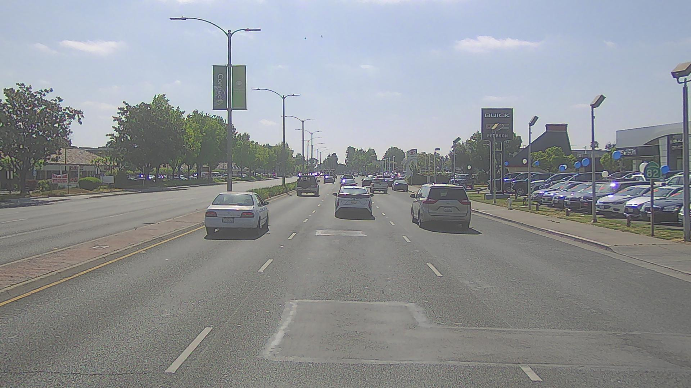
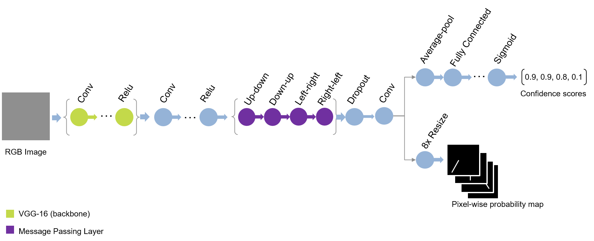

# Lane Detection Using Pre-trained Spatial-CNN

This repository implements a pretrained Spatial-CNN (SCNN)[1] lane detection model in MATLAB&reg;.

## Requirements
- MATLAB&reg; R2021a or later.
- Deep Learning Toolbox&trade;.
- Computer Vision Toolbox&trade;.
- Autonomous Driving Toolbox&trade;.

## Overview
This repository implements SCNN with VGG-16 as the backbone. The pretrained network is trained to detect lanes in the image. The network is trained using [CULane](https://xingangpan.github.io/projects/CULane.html) dataset[2].

Spatial-CNN (SCNN) uses slice-by-slice convolutions on the feature maps obtained by layer-by-layer convolutions since the spatial information can be reinforced via inter-layer propagation. This helps in detecting objects with strong structure prior but less appearance clues such as lanes, poles, or trucks with occlusions.

## Getting Started
Download or clone this repository to your machine and open it in MATLAB®.

### Setup
Add path to the source directory.
```
addpath('src');
```

### Download and Load the Pretrained Network
Use the below helper to download and load the pretrained network. The network will be downloaded and saved in `model` directory.
```
model = helper.downloadSCNNLaneDetection;
net = model.net;
```

### Detect Lanes Using SCNN
This snippet includes all the steps required to run SCNN model on a single RGB image in MATLAB®. Use the script `spatialCNNLaneDetectionExample.m` to run the inference on single image.

```
% Specify Detection Parameters.
params = helper.createSCNNDetectionParameters;

% Specify the executionEnvironment as either "cpu", "gpu", or "auto".
executionEnvironment = "auto";

% Read the test image.
path = fullfile("images","testImage.jpg");
image = imread(path);

% Use detectLaneMarkings function to detect the lane markings.
laneMarkings = detectLaneMarkings(net, image, params, executionEnvironment);

% Visualize the detected lanes.
fig = figure;
helper.plotLanes(fig, image, laneMarkings);

```

Alternatively, you can also run the SCNN model on sample videos. Use the script `spatialCNNLaneDetectionVideoExample.m` to run the inference on a driving scene.


### Result
Left-side image is the input and right-side image shows the detected lanes. The image is taken from the [Panda Set](https://scale.com/open-datasets/pandaset) dataset[2].

<table>
<tr>
    <td>  </td>
    <td>  </td>
</tr>
</table>

Sample video output generated by the script `spatialCNNLaneDetectionVideoExample.m`.

 

## Evaluation Metrics
The model is evaluated using the method specified in [1].

| Dataset  | Error Metric | IOU | Result | 
| ------------- | ------------- | ------------- | ------------- |
| CULane  | F-measure  | 0.3 | 73.45 |
| CULane  | F-measure | 0.5 | 43.41 |

## Spatial-CNN Algorithm Details
The SCNN network architecture is illustrated in the following diagram.
||
|:--:|
|**Fig.1**|


The network takes RGB images as input and outputs a probability map and confidence score for each lane. The pre-trained SCNN model trained on [CULane](https://xingangpan.github.io/projects/CULane.html) can detect maximum of 4 lanes( 2 driving lanes and 2 lanes on either side of the driving lane). The probability map predicted by the network has 5 channels (4 lanes + 1 background). Lanes with confidence score less than 0.5 are ignored. To generate the detections the probability map is processed and curves are fit.


SCNN network in this repository has 4 message passing layers in sequence in the directions top-to-bottom, bottom-to-top, left-to-right, and right-to-left with kernel size of 9 and are represented by up-down, down-up, left-right, and right-left respectively in Fig.1. The message passing layers are special layers that apply slice-by-slice convolutions within the feature map[1]. These layers are implemented as a custom nested deep learning layer. For more information about the custom nested deep learning layer, see [Define Nested Deep Learning Layer](https://www.mathworks.com/help/deeplearning/ug/define-nested-deep-learning-layer.html).

## References

[1] Xingang Pan, Jianping Shi, Ping Luo, Xiaogang Wang, and Xiaoou Tang. "Spatial As Deep: Spatial CNN for Traffic Scene Understanding" AAAI Conference on Artificial Intelligence (AAAI) - 2018

[2] [Panda Set](https://scale.com/open-datasets/pandaset) is provided by Hesai and Scale under the [CC-BY-4.0 license](https://creativecommons.org/licenses/by/4.0)

## See also
[Visual Perception Using Monocular Camera](https://www.mathworks.com/help/driving/ug/visual-perception-using-monocular-camera.html)

Copyright 2021 The MathWorks, Inc.

